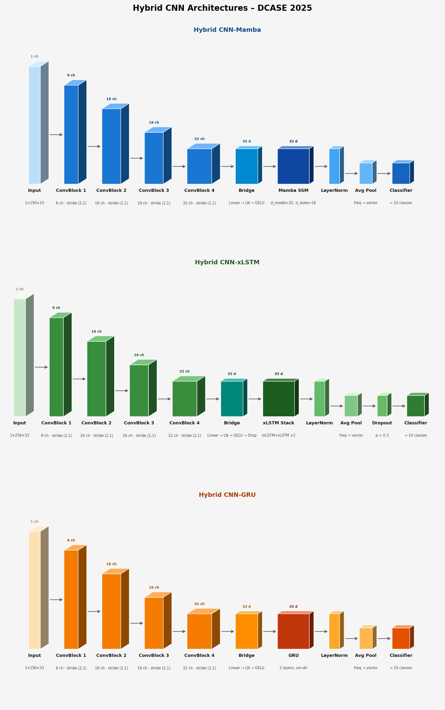
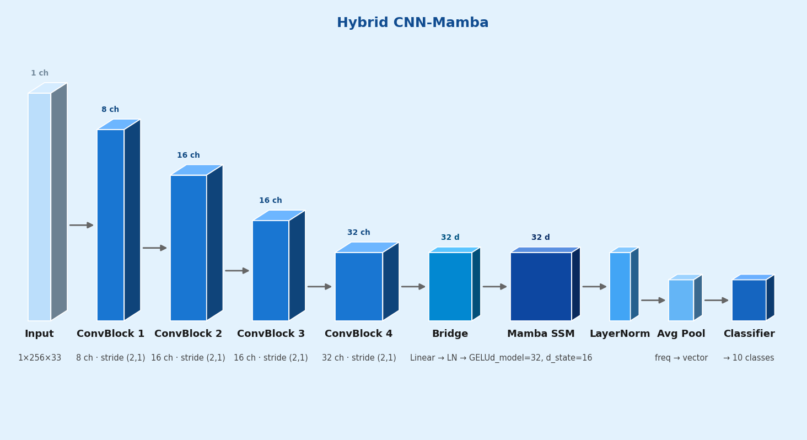
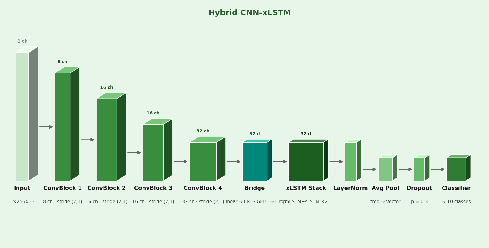
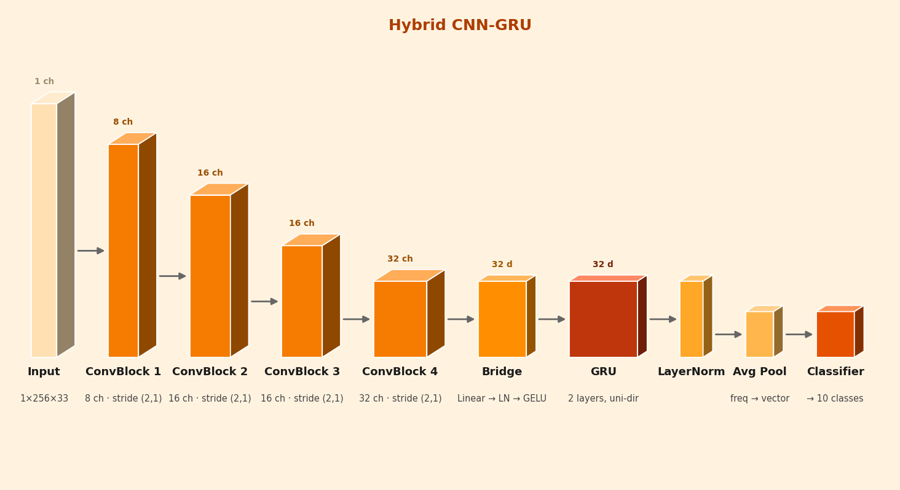
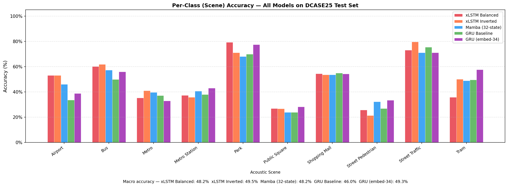
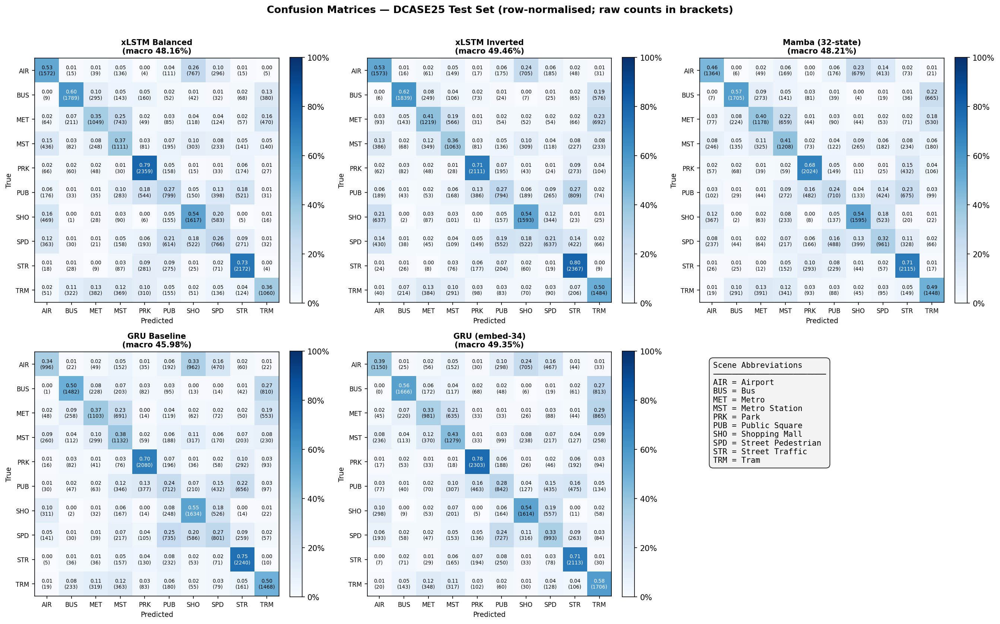
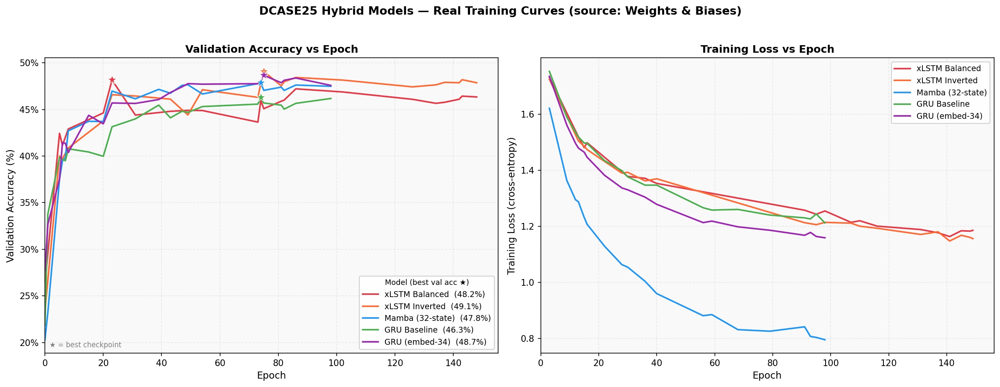
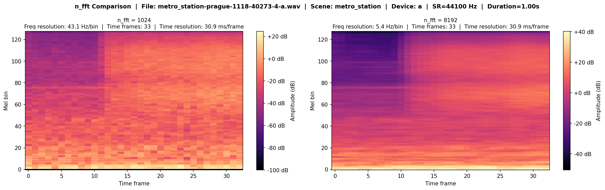

# Hybrid CNN-Sequence Models for Edge-Constrained Environmental Sound Classification
### DCASE 2025 Challenge — Task 1: Low-Complexity Acoustic Scene Classification

---

## Abstract

This repository presents a systematic comparison of three hybrid CNN-sequence architectures — **CNN-Mamba**, **CNN-xLSTM**, and **CNN-GRU** — for acoustic scene classification under strict edge-device constraints (≤128 KB model size in FP16, ≤30 M MACs). All models follow the **SNTL-NTU frequency-scanning paradigm**, treating mel-spectrogram frequency bins as the sequence dimension rather than time steps. Experiments are conducted on the TAU Urban Acoustic Scenes 2022 Mobile dataset using the official DCASE 2025 Task 1 evaluation protocol. Results demonstrate that xLSTM variants and Mamba achieve competitive macro-average accuracies (~48–49%) while satisfying edge-deployment constraints, outperforming the GRU baseline.

---

## Table of Contents

- [Background](#background)
- [Architecture Overview](#architecture-overview)
- [Model Variants](#model-variants)
- [Results](#results)
- [Dataset](#dataset)
- [Repository Structure](#repository-structure)
- [Installation](#installation)
- [Usage](#usage)
- [Experiment Tracking](#experiment-tracking)
- [Citation](#citation)

---

## Background

The DCASE 2025 Challenge Task 1 targets acoustic scene classification on resource-constrained edge devices. The core challenge is achieving competitive classification accuracy within a tight budget:

| Constraint | Limit |
|---|---|
| Model size (FP16) | ≤ 128 KB |
| Multiply-accumulate operations | ≤ 30 M MACs |
| Audio classes | 10 urban scenes |
| Recording devices | 9 (3 real + 6 simulated) |

Standard large-scale sequence models (Transformers, full LSTMs) are prohibitive under these constraints. This work investigates whether modern state-space models (Mamba) and extended LSTM variants (xLSTM) can outperform the GRU baseline when embedded within a compact CNN feature extractor, using frequency scanning as the sequence inductive bias.

---

## Architecture Overview

All three architectures share a common backbone design:

```
Input Mel-Spectrogram  [B, 1, 256, 33]
         │
   ┌─────▼─────┐
   │  CNN Block │  4× ConvBlock with Squeeze-and-Excitation attention
   └─────┬─────┘
         │  [B, C, F', T']
   ┌─────▼────────────────┐
   │  Frequency Transpose │  Permute: time-first → frequency-first
   └─────┬────────────────┘
         │  [B, F', C×T']
   ┌─────▼──────────────┐
   │  Bridge Projection  │  Linear + LayerNorm + GELU → embed_dim
   └─────┬──────────────┘
         │  [B, F', embed_dim]
   ┌─────▼──────────────┐
   │   Sequence Engine   │  Mamba / xLSTM / GRU  ← architecture varies here
   └─────┬──────────────┘
         │
   ┌─────▼──────────────┐
   │  Global Avg Pool   │  Pool over frequency dimension
   └─────┬──────────────┘
         │
   ┌─────▼──────┐
   │ Classifier  │  Linear → 10 logits
   └────────────┘
```

The **frequency-scanning** approach treats each mel-frequency bin as a token in the sequence. This reduces sequence length (compared to time-scanning), yields lower latency, and aligns with the spectral correlation structure of acoustic scenes.

**Squeeze-and-Excitation (SE)** blocks in the CNN provide channel-wise attention that suppresses device-specific noise before the sequence engine processes spectral patterns.



---

## Model Variants

### CNN-Mamba

The Mamba block uses a **selective state-space mechanism** (S4/S6) that selectively propagates information along the frequency sequence. It achieves O(N) complexity in sequence length, making it particularly efficient for the compact embedded setting.

- Mamba block: `d_model=embed_dim`, `d_state=32`, `d_conv=4`, `expand=2`
- Residual formulation: `x ← x + Mamba(LayerNorm(x))`



### CNN-xLSTM

The xLSTM variant introduces **matrix memory** (mLSTM) and **scalar memory** (sLSTM) blocks, which extend classic LSTM with exponential gating and enhanced memory capacity. Layers can be configured as a mix of mLSTM and sLSTM blocks.

- Configurable mixing via `--slstm_at` (list of layer indices using sLSTM)
- *Balanced* config (`slstm_at=[1]`, depth=2): one mLSTM + one sLSTM
- *Inverted* config (sLSTM-heavy): reversed block ordering



### CNN-GRU (Baseline)

A **bidirectional GRU** serves as the recurrent baseline. It provides an established, well-understood reference point for evaluating the state-space and extended-LSTM alternatives.

- Bidirectional with `layers=depth`, `hidden_size=embed_dim`
- Comparable parameter count to Mamba and xLSTM variants



---

## Results

### Per-Class Accuracy Breakdown

All models are evaluated on the official DCASE 2025 Task 1 test split. The primary metric is **macro-average accuracy** across all 10 acoustic scene classes, which accounts for class imbalance across devices.



| Model | Airport | Bus | Metro | Metro Stn. | Park | Public Sq. | Shopping | Street Ped. | Street Traffic | Tram | **Macro Avg** |
|---|---|---|---|---|---|---|---|---|---|---|---|
| xLSTM Inverted | 53.1 | 61.9 | **41.0** | 35.8 | 71.1 | 26.7 | 53.6 | 21.4 | **80.0** | **50.1** | **49.5%** |
| GRU (embed-34) | 38.9 | 56.1 | 33.0 | **43.1** | **77.5** | **28.4** | 54.3 | **33.4** | 71.1 | 57.6 | 49.3% |
| xLSTM Balanced | 53.1 | 60.2 | 35.3 | 37.4 | **79.4** | 26.9 | **54.4** | 25.8 | 73.1 | 35.8 | 48.2% |
| Mamba (32-state) | 46.1 | 57.4 | 39.7 | 40.7 | 68.1 | 23.9 | 53.7 | 32.4 | 71.2 | 48.9 | 48.2% |
| GRU Baseline | 33.6 | 49.9 | 37.1 | 38.1 | 70.0 | 24.0 | 55.0 | 27.0 | 75.4 | 49.6 | 46.0% |

**Key findings:**
- **xLSTM Inverted** achieves the highest macro-average (49.5%), driven by strong performance on street traffic and tram scenes.
- **GRU (embed-34)** is competitive at 49.3%, demonstrating that careful embedding dimensioning can close the gap with more complex architectures.
- **Mamba (32-state)** and **xLSTM Balanced** tie at 48.2%, both outperforming the standard GRU baseline (46.0%).
- *Public square* and *street pedestrian* are the hardest scenes across all models (≤33%), likely due to high acoustic overlap with other outdoor scenes.

### Confusion Matrices

Confusion matrices reveal systematic misclassification patterns. Metro and metro station scenes show the highest cross-confusion, consistent with their shared reverberant acoustic properties.



### Training Curves



All models converge within 150 epochs using cosine annealing with linear warm-up. The xLSTM variants show slower early convergence but ultimately reach higher validation accuracy.

---

## Dataset

**TAU Urban Acoustic Scenes 2022 Mobile** (DCASE 2025 Task 1)

| Property | Value |
|---|---|
| Classes | 10 acoustic scenes |
| Recording devices | 9 (A, B, C + S1–S6) |
| Sample rate | 44,100 Hz |
| Segment length | 10 seconds |
| Mel bins | 256 |
| Spectrogram frames | 33 |
| STFT parameters | n_fft=8192, hop=1364 |

### NFFT Resolution Comparison

The SNTL-NTU ultra-high-resolution spectrogram (n_fft=8192) resolves finer spectral structures compared to the standard EfficientAT configuration (n_fft=1024), which is critical for distinguishing acoustically similar scenes.



### Device Groups

| Group | Devices | Description |
|---|---|---|
| Real | A, B, C | Physical recording devices |
| Seen simulated | S1, S2, S3 | Simulated during training |
| Unseen simulated | S4, S5, S6 | Held-out for generalization test |

### Dataset Splits

Training subsets of 25%, 50%, and 100% are supported via official CP-JKU split files, which are automatically downloaded on first run.

---

## Repository Structure

```
hybrid-cnn-mamba-dcase25/
├── models/
│   ├── hybrid_net.py          # CNN-Mamba architecture
│   ├── hybrid_gru.py          # CNN-GRU architecture
│   ├── hybrid_xlstm.py        # CNN-xLSTM architecture
│   ├── net.py                 # AudioMamba baseline wrapper
│   ├── multi_device_model.py  # Per-device model container
│   └── mn/                    # EfficientAT pretrained backbone
├── dataset/
│   ├── dcase25.py             # Dataset loader (TAU 2022 Mobile)
│   └── meta_data_preprocessing.py
├── helpers/
│   ├── complexity.py          # MACs & model size profiling
│   ├── utils.py               # Mixstyle domain augmentation
│   └── init.py                # Deterministic DataLoader seeding
├── scripts/
│   ├── visualize_architectures.py
│   ├── generate_training_curves.py
│   ├── generate_confusion_matrices.py
│   ├── generate_per_class_breakdown.py
│   └── visualize_nfft_comparison.py
├── distillation/
│   ├── train_teacher.py       # EfficientAT teacher training
│   └── train_distillation.py  # Knowledge distillation pipeline
├── assets/                    # Generated figures and result tables
├── train_hybrid_cnn.py        # Primary training script
├── train_base.py              # AudioMamba baseline training
├── evaluate.py                # Test-set evaluation with CIs
├── finetune_device.py         # Device-specific fine-tuning
└── requirements.txt
```

---

## Installation

```bash
git clone --recurse-submodules https://github.com/abdalazizayoub/hybrid-cnn-mamba-dcase25.git
cd hybrid-cnn-mamba-dcase25
pip install -r requirements.txt
```

> **Note:** The Mamba SSM kernel requires CUDA 11.6+ and a compatible GPU. For CPU-only environments, use the `--sequence_engine gru` or `--sequence_engine xlstm` flags.

---

## Usage

### Training

```bash
# CNN-xLSTM (balanced: mLSTM + sLSTM)
python train_hybrid_cnn.py \
  --sequence_engine xlstm \
  --experiment_name "xLSTM_Balanced_Depth2" \
  --embed_dim 32 \
  --depth 2 \
  --slstm_at 1 \
  --batch_size 32 \
  --n_epochs 150 \
  --precision "16-mixed"

# CNN-Mamba
python train_hybrid_cnn.py \
  --sequence_engine mamba \
  --experiment_name "Mamba_32state" \
  --embed_dim 32 \
  --depth 2 \
  --batch_size 32 \
  --n_epochs 150

# CNN-GRU baseline
python train_hybrid_cnn.py \
  --sequence_engine gru \
  --experiment_name "GRU_Baseline" \
  --embed_dim 32 \
  --depth 2 \
  --batch_size 32 \
  --n_epochs 150
```

### Evaluation

```bash
python evaluate.py \
  --checkpoint_path checkpoints/best_model.ckpt \
  --sequence_engine xlstm
```

Outputs per-device, per-scene, and macro-average accuracy with 95% confidence intervals.

### Device-Specific Fine-Tuning

```bash
python finetune_device.py \
  --base_checkpoint checkpoints/best_model.ckpt \
  --sequence_engine xlstm \
  --n_epochs 30
```

### Knowledge Distillation

```bash
# Step 1: Train EfficientAT teacher
python distillation/train_teacher.py

# Step 2: Distill into hybrid student
python distillation/train_distillation.py \
  --teacher_checkpoint checkpoints/teacher.ckpt \
  --sequence_engine xlstm
```

---

## Key Hyperparameters

| Parameter | Default | Description |
|---|---|---|
| `--sequence_engine` | `xlstm` | Architecture: `mamba`, `xlstm`, `gru` |
| `--embed_dim` | `32` | Sequence model embedding dimension |
| `--depth` | `2` | Number of sequence blocks |
| `--slstm_at` | `[1]` | xLSTM only: sLSTM block indices |
| `--n_mels` | `256` | Mel-spectrogram frequency bins |
| `--batch_size` | `32` | Training batch size |
| `--lr` | `0.0005` | Peak learning rate |
| `--n_epochs` | `150` | Total training epochs |
| `--warmup_steps` | `1000` | Linear LR warm-up steps |
| `--precision` | `16-mixed` | Mixed-precision training |

---

## Experiment Tracking

All experiments are logged to **Weights & Biases**. Tracked metrics include:

- `train/loss`, `val/loss`
- `val/macro_avg_acc` (primary metric, used for checkpointing)
- `val/acc.{device}` — per-device accuracy (A, B, C, S1–S6)
- `val/acc.{scene}` — per-scene accuracy (10 scenes)
- `Model_MACs_Millions`, `Model_Size_FP16_KB` — complexity budget

To disable WandB logging, set `WANDB_MODE=disabled` before running training.

---

## Augmentation Pipeline

| Technique | Configuration | Purpose |
|---|---|---|
| Time shift (roll) | ±0.1 s | Temporal translation invariance |
| Frequency masking | 24 bins | Spectral robustness (SpecAugment) |
| Time masking | 10 frames | Temporal robustness (SpecAugment) |
| Mixup | β(0.3, 0.3), p=0.5 | Label smoothing via interpolation |
| Mixstyle | α=0.5, p=0.6 | Cross-device domain generalization |
| Label smoothing | ε=0.1 | Calibration and overfitting prevention |

---

## Citation

If you use this work, please cite:

```bibtex
@misc{ayoub2025hybridcnnmamba,
  title   = {Hybrid CNN-Sequence Models for Edge-Constrained Acoustic Scene Classification},
  author  = {Ayoub, Abdalaziz},
  year    = {2025},
  note    = {DCASE 2025 Challenge, Task 1},
  url     = {https://github.com/abdalazizayoub/hybrid-cnn-mamba-dcase25}
}
```

---

## Acknowledgements

- **DCASE Community** for the TAU Urban Acoustic Scenes 2022 Mobile dataset and evaluation framework.
- **CP-JKU** for the official train/test split files and DCASE 2024 Task 1 baseline.
- **SNTL-NTU** for the frequency-scanning CNN paradigm.
- **AUM** (Audio Understanding Mamba) for the AudioMamba backbone.
- **mamba-ssm** and **xlstm** libraries for efficient SSM/xLSTM implementations.
